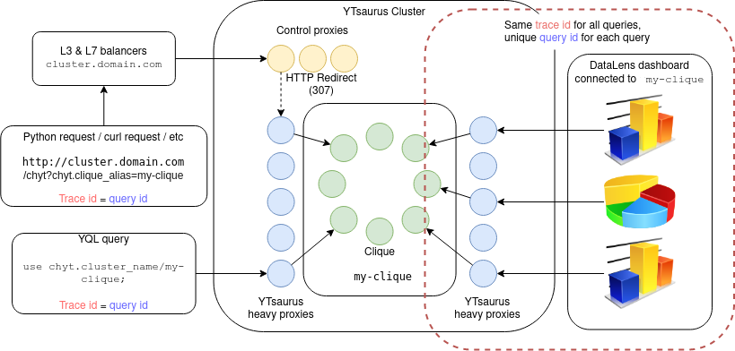

# Query anatomy before and after the ClickHouse engine

This article describes the CHYT query architecture and where you can get the query execution information.

## Query IDs: `trace id`, `query id`, and `datalens request id` { #id }

There are several IDs associated with any query which allow you to restore all the necessary query execution information post factum.

- `query id` is the ID assigned to each query in ClickHouse. Unlike original ClickHouse, this ID in CHYT is not controlled by the user and always has the *{{product-name}} GUID* form — four hexadecimal uint32 separated by hyphens.
- `trace id` is the ID that allows you to chain calls in distributed systems, creating a query execution "trace". This is a part of the [opentracing](https://opentracing.io/) protocol, specifically its implementation called [Jaeger Tracing](https://www.jaegertracing.io/) that is used in {{product-name}}. `trace id` is also a {{product-name}} GUID that in some cases coincides with `query id` and in other cases does not as will be detailed below.

## Query execution journey from the client to heavy proxies { #way-to-proxy }

To better understand the logic by which these IDs exist and are assigned, figure out through which components and in which order the query passes to CHYT. Currently, the only public API to access CHYT is the HTTP API, so the following description applies specifically to the HTTP protocol.

The first important point in the query execution journey is the so-called _heavy {{product-name}} proxies_, which all {{product-name}} users have network access to. Heavy proxies find out where instances of the clique with a given alias currently reside, then send a query to a randomly selected instance.

The three most popular ways to access {{product-name}} are shown below.

{ .center }

When you access CHYT directly from a script or from the command line using the cURL utility, an SLB balancer (for example, `http://$YT_PROXY`) acts as the endpoint. Behind it lies a complex construction of balancers that directs the query to so-called *control proxies*, which respond with an HTTP redirect to the heavy proxies servicing all the heavy load in {{product-name}}. With this access interface, the `query id` matches the `trace id`: you can see them in the `X-Yt-Trace-Id` and `X-ClickHouse-Query-Id` headers.

Below is an example of interaction with CHYT using the cURL utility, with the most notable response headers indicated.



In {{product-name}} 24.1 and lower, a clique alias is specified with an asterisk at the beginning. For example, `*ch_public`. In the current version, `*ch_public` and `ch_public` are the same alias.

When CHYT is accessed using the deprecated `/query` path, the alias is passed via the `database` url parameter. When CHYT is accessed using the new `/chyt` path, the alias is taken from `user` or the `chyt.clique_alias` URL parameter.



```bash
$ curl -v --location-trusted 'http://$YT_PROXY/chyt?chyt.clique_alias=ch_public' -d 'select max(a) from "//sys/clickhouse/sample_table"' -H "Authorization: OAuth `cat ~/.yt/token`"
*   Trying ip_address:80...
* Connected to $YT_PROXY (ip_address) port 80 (#0)
> POST /chyt?chyt.clique_alias=ch_public HTTP/1.1
> Host: $YT_PROXY
> User-Agent: curl/7.69.1-DEV
> Accept: */*
> Authorization: OAuth <i>...<my_token>...</i>
> Content-Length: 50
> Content-Type: application/x-www-form-urlencoded
>
* upload completely sent off: 50 out of 50 bytes
* Mark bundle as not supporting multiuse
<b> // Getting a redirect to a heavy proxy.</b>
< HTTP/1.1 307 Temporary Redirect
< Content-Length: 0
< Location: http://sas4-9923-proxy-$YT_PROXY/chyt?chyt.clique_alias=ch_public
< X-Yt-Trace-Id: 8e9bcc43-5c2be9b4-56f18c4e-117ea314
<
* Connection #0 to host $YT_PROXY left intact
* Issue another request to this URL: 'http://sas4-9923-$YT_PROXY/chyt?chyt.clique_alias=ch_public'
*   Trying ip_address:80...
* Connected to sas4-9923-$YT_PROXY (ip_address) port 80 (#1)
> POST /chyt?chyt.clique_alias=ch_public HTTP/1.1
> Host: sas4-9923-$YT_PROXY
> User-Agent: curl/7.69.1-DEV
> Accept: */*
> Authorization: OAuth <i>...<my_token>...</i>
> Content-Length: 50
> Content-Type: application/x-www-form-urlencoded
>
* upload completely sent off: 50 out of 50 bytes
* Mark bundle as not supporting multiuse
< HTTP/1.1 200 OK
< Transfer-Encoding: chunked
<b>  // Note: query id = trace id. </b>
< <b>X-ClickHouse-Query-Id:</b> 3fa9405e-15b29877-524e3e67-2be50e94
< <b>X-Yt-Trace-Id:</b> 3fa9405e-15b29877-524e3e67-2be50e94
<b>  // For technical reasons, X-Yt-Trace-Id will appear twice.</b>
< X-Yt-Trace-Id: 3fa9405e-15b29877-524e3e67-2be50e94
< Keep-Alive: timeout=10
<b>  // Address of the query coordinator instance. </b>
< <b>X-ClickHouse-Server-Display-Name:</b> sas2-1374-node-$YT_PROXY
< X-Yt-Request-Id: 3fa9405d-26285349-db14531a-2a12b9f9
< Date: Sun, 05 Apr 2020 18:49:57 GMT
< Content-Type: text/tab-separated-values; charset=UTF-8
< X-ClickHouse-Summary: {"read_rows":"0","read_bytes":"0","written_rows":"0","written_bytes":"0","total_rows_to_read":"0"}
<b>  // Address of the heavy proxy that served the query. </b>
< <b>X-Yt-Proxy:</b> sas4-9923-$YT_PROXY
<
1100
* Connection #1 to host sas4-9923-$YT_PROXY left intact
```
