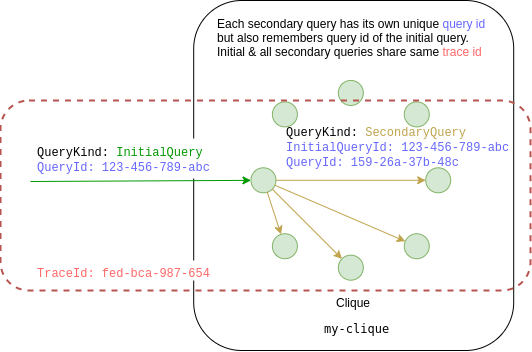

## Исполнение запроса внутри клики { #query_execution }

Тяжёлая прокси [выбирает](../../../../../user-guide/data-processing/chyt/queries/instance-pick.md) один инстанс из клики и делегирует ему исполнение запроса. Данный инстанс называется «координатором» (или «инициатором») запроса. Если запрос не использует таблицы {{product-name}} (например, он обращается только к системным таблицам, начинающимся с префикса `system.`, или это примитивный запрос типа `SELECT 1`), то он исполняется на координаторе так же, как и в обычном ClickHouse.

Если же запрос затрагивает таблицы {{product-name}}, то он всегда исполняется распределённым образом. Рассмотрим исполнение на примере простейшего сканирующего запроса, возможно с фильтрацией, проекцией и агрегацией:

`SELECT someColumns, someFunctions(someColumns) FROM "//path/to/table" WHERE somePredicate(someColumns) [GROUP BY someColumns]`.

Данный запрос приводит к разбиению таблицы `//path/to/table` на примерно равные части, каждая из которых будет независимо обрабатываться на одном из узлов клики. Фактически, на каждый инстанс поступит видоизменённый запрос, у которого в FROM-клаузе `//path/to/table` будет заменено на некоторое выражение вида `ytSubquery(...)`, в аргументе которого закодировано описание очередной части таблицы.

Таким образом, исполнение запроса сводится к исполнению некоторого количества удалённых подзапросов на инстансах клики. Картинка выше иллюстрирует данный механизм.

Здесь полезно понимать, что запросы бывают двух видов:

- `QueryKind: InitialQuery` — исходные запросы, приходящие от клиентов;
- `QueryKind: SecondaryQuery` — это переписанные удалённые подзапросы, в которых в FROM-клаузе фигурируют конкретные части таблиц {{product-name}}.

Каждый secondary запрос наследует `trace id` родителя. При этом у каждого secondary запроса свой собственный `query id`; но несмотря на это каждый secondary запрос помнит initial запрос, к которому он относится. В логах системы родительский `query id` исходного initial запроса для secondary запроса обозначается термином `InitialQueryId`.

## IO и компрессия в CHYT

Ниже приведён ряд фактов и рекомендаций касательно чтения данных из {{product-name}}. Учитывайте их при использовании CHYT.

### Про сеть

Инстансы любой клики запускаются на случайных машинах кластера, поэтому, скорее всего, чтение данных будет происходить по сети. Грубо можно полагать, что каждый очередной гигабайт данных, которые надо прочитать, будет находиться на новых машинах кластера.

При этом следует отметить, что сеть внутри кластеров {{product-name}} редко оказывается узким местом, но и такое иногда случается.

### Про компрессию

Данные в {{product-name}}, как правило, хранятся в **сжатом** виде. За компрессию отвечает атрибут `/@compression_codec` на таблице, его также можно увидеть в веб-интерфейсе просмотра таблицы. Про это есть отдельная [статья](../../../../../user-guide/storage/compression.md) в документации.

Данные сжатых таблиц читаются инстансами в сжатом виде и далее разжимаются непосредственно перед обработкой их движком ClickHouse. Разжатие данных относится на графике CPU [дашборда CHYT](../../../../../user-guide/data-processing/chyt/cliques/dashboard.md) к категории [CHYT FSCompression](../../../../../user-guide/data-processing/chyt/cliques/dashboard.md#cpu). Чем сильнее кодек сжатия, тем дороже разжимать данные — учитывайте это при выборе кодека сжатия для данных.

### Про uncompressed block cache

В CHYT есть **uncompressed block cache**, под который по умолчанию отводится 20 GiB. Размер кеша можно регулировать параметром `--uncompressed-block-cache-size` в строке запуска клики.

Этот кеш заполняется разжатыми блоками недавно прочитанных таблиц, вследствие чего исполнение запроса поверх данных, прочитанных за малое время до того другим запросом, оказывается сильно быстрее, так как часть данных уже может быть готовой и доступной в памяти инстансов. Для эффективного использования данного кеша должны соблюдаться следующие условия:

- Кеш хорошо работает, пока состав инстансов в клике остаётся неизменным. Если какой-то инстанс пропадает (например, из-за preemption, выхода ноды {{product-name}} из строя или падения CHYT), то распределение будущих подзапросов по инстансам меняется произвольным образом и большая часть закешированных блоков данных в памяти инстансов может стать бесполезной, т. е. вырастет block cache miss. Впрочем, следующий же запрос после такой ситуации восстановит в кеше нужные данные.
- Если данные в таблице меняются, то и распределение частей таблицы по подзапросом меняется произвольным образом, что аналогично приводит к block cache miss.
- Наконец, если на один инстанс приходится существенно больше обрабатываемых данных, чем размер block cache (в терминах uncompressed data size), то довольно очевидно, что использование кеша не даст большой пользы для последующих запросов по тем же данным, так как большую часть все равно придётся заново прочитать по сети.

### Про HDD vs SSD

Чтение с HDD медленнее, чем с SSD, однако не следует бросаться перекладывать свои данные на SSD, как только ваши запросы начинают тормозить. Есть вероятность, что ваши запросы упираются не в IO, а в CPU — например, все данные лежат готовые в block cache, но для ответа на запрос нужно обработать пару десятков гигабайт разжатых данных. В такой ситуации перекладывание таблиц с HDD на SSD не даст пользы.

Если вам кажется, что перекладывание ваших данных на SSD ускорит ваши запросы (в частности, вы ознакомились с разбором случаев из статьи [Диагностика](../../../../../user-guide/data-processing/chyt/queries/diagnostics.md)), то можете проследовать [плану действий](../../../../../user-guide/data-processing/chyt/faq-chyt.md#how-to-set-ssd) из FAQ.

### Про поколоночный формат хранения

В большинстве случаев при работе с ClickHouse вы захотите использовать поколоночный [формат хранения](../../../../../user-guide/storage/chunks.md#optimize_for) таблиц, который достигается выставлением атрибута `/@optimize_for` в значение `scan`.

Преимущества поколоночного хранения заключаются в следующем: вы можете дёшево читать отдельные колонки таблиц без необходимости поднимать всю таблицу в память, а также экономить занимаемое на диске место, так как {{product-name}} будет применять различные кодеки поколоночного хранения для оптимизации представления колонки.

Тем не менее, возможна ситуация, при которой понадобится построчный формат (`/@optimize_for = lookup`). Недостатком поколоночного формата является высокое потребление памяти, особенно для таблиц с большим числом колонок, так как на каждую колонку требуется отдельный буфер. Помимо этого можно отметить, что чтение lookup-таблиц несколько дешевле по CPU.